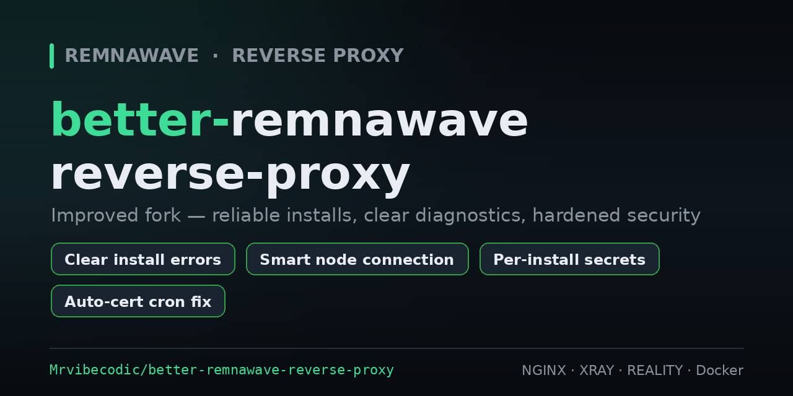

<p align="center">
  
</p>

<p align="center">
  <a href="https://www.gnu.org/software/bash/"></a>
  
  
  <a href="./LICENSE"></a>
</p>

<p align="center">
  <a href="/README.md">English</a> | <strong>Русский</strong>
</p>

<p align="center">
  Улучшенный форк <a href="https://github.com/eGamesAPI/remnawave-reverse-proxy">eGamesAPI/remnawave-reverse-proxy</a> —
  с упором на <b>надёжную установку</b>, <b>понятную диагностику</b> и <b>безопасные дефолты</b>.
</p>

---

> [!CAUTION]
> **Этот репозиторий — учебный пример для изучения NGINX, реверс‑прокси и основ сетевой безопасности. Не для продакшена. Используйте на свой страх и риск.**

---

## 🚀 Быстрый старт

```bash
bash <(curl -Ls https://raw.githubusercontent.com/Mrvibecodic/better-remnawave-reverse-proxy/refs/heads/main/install_remnawave.sh)
```

> Поддержка Debian 11/12 и Ubuntu 22.04/24.04. Запускать от **root** на чистой системе. Нужен свой домен.

---

## ✨ Что улучшено в форке

Всё из оригинала, плюс:

| Область | Улучшение |
|---------|-----------|
| **Ошибки установки** | Вызовы API возвращают корректные коды и **останавливают** установку, а не идут дальше с пустыми значениями; каждый сбой указывает на лог. |
| **Подключение отдельной ноды** | Показывает **IP этого сервера** и точный порядок в панели, затем различает: *нода отдаёт трафик* / *ядро поднято, но ждёт конфиг от панели* / *контейнер упал (неверный SECRET_KEY)* — с подсказками. |
| **Безопасность** | У каждой установки свои случайные `WEBHOOK_SECRET_HEADER` и пароль PostgreSQL (никаких общих зашитых секретов); `chmod 600` на `.env` и `docker-compose.yml`. |
| **Крон сертификата** | Больше нет еженедельного простоя — nginx перезапускается **только при реальном обновлении** (certbot `renew_hook`). |
| **Зависимости** | Preflight: показывает версии и предлагает одним **y/n** обновить управляемые пакеты + Docker; гарантирован `openssl`; **arch‑aware** `yq` (amd64/arm64) с валидацией загрузки; понятные ошибки `certbot-dns-gcore` (pip). |
| **Загрузки Docker** | Ошибки `docker compose` показываются (в т.ч. **лимиты Docker Hub**), а не уходят в `/dev/null`; опциональный промпт **зеркала реестра** для обхода лимитов/блокировок. |
| **Надёжность** | Стабильная локаль через `LC_ALL`; исправлены унаследованные баги — проверка конфига WARP перед PATCH, остановка спиннера/выходы в selfsteal, `exit`→`return` в меню‑функциях, безопаснее IPv6. |

Подробный построчный список изменений ведётся автором в заметках проекта.

---

## 🧩 Режимы развёртывания

- **Один сервер** — панель + XRAY‑нода на одной машине (быстрый старт / умеренный трафик).
- **Распределённо** — **сервер панели** (управление) + **сервер ноды** (XRAY с заглушкой SelfSteal для VLESS REALITY).

Архитектура: Xray слушает **443**, перед ним NGINX (или Caddy) через **Unix‑сокет** — минимум TCP‑оверхеда, дружелюбно к REALITY.

### Домены

Подготовьте три имени: **панель**, **страница подписки**, **заглушка SelfSteal** (на ноде).
SSL через **Cloudflare API**, **Gcore API** (wildcard, DNS‑01) или **ACME HTTP‑01**.

> Полные таблицы DNS и пошаговое развёртывание из оригинала — в **[README-RU-upstream.md](./README-RU-upstream.md)**.

---

## 🔐 Безопасность

- Скрытие панели за URL‑параметром + cookie (защита от сканеров и перебора).
- Правила UFW; NODE_PORT открывается **только** для IP панели (с предупреждением, если UFW не активен).
- ECDSA‑сертификаты с автообновлением; BBR.
- Контейнеризованные nginx/caddy/Postgres/Valkey — пины образов для воспроизводимости.

---

## 🙌 Благодарности

Сделано на базе **[eGamesAPI/remnawave-reverse-proxy](https://github.com/eGamesAPI/remnawave-reverse-proxy)** — вся оригинальная работа и документация принадлежат авторам (сохранены как **[README-RU-upstream.md](./README-RU-upstream.md)**). На основе [Remnawave](https://remna.st) и [XRAY](https://github.com/XTLS/Xray-core).

---

> [!CAUTION]
> **Только для образовательных и исследовательских целей. Обход блокировок/цензуры может быть незаконен в вашей стране. Авторы не несут ответственности за правовые последствия. Сомневаетесь в законности — не используйте.**
