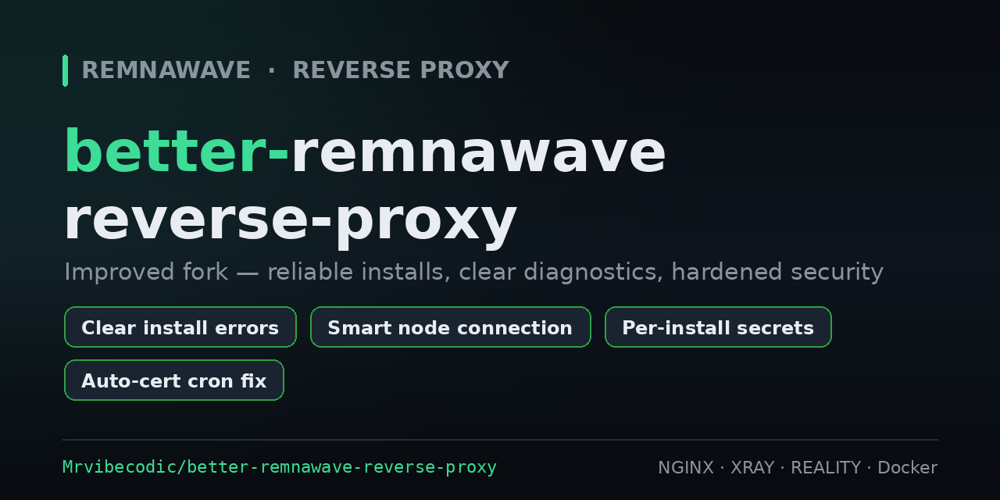

<p align="center">
  
</p>

<p align="center">
  <a href="https://www.gnu.org/software/bash/"></a>
  
  
  
  
  <a href="./LICENSE"></a>
</p>

<p align="center">
  <a href="/README.md">English</a> | <strong>Русский</strong>
</p>

<p align="center">
  Улучшенный форк <a href="https://github.com/eGamesAPI/remnawave-reverse-proxy">eGamesAPI/remnawave-reverse-proxy</a> —
  с упором на <b>надёжную установку</b>, <b>понятную диагностику</b> и <b>безопасные дефолты</b>.
</p>

---

> [!CAUTION]
> **Этот репозиторий — учебный пример для изучения NGINX, реверс‑прокси и основ сетевой безопасности. Не для продакшена. Используйте на свой страх и риск.**

---

## 🚀 Быстрый старт

```bash
bash <(curl -Ls https://raw.githubusercontent.com/Mrvibecodic/better-remnawave-reverse-proxy/refs/heads/main/install_remnawave.sh)
```

> Поддержка Debian 11/12/13 и Ubuntu 22.04/24.04. Запускать от **root** на чистой системе. Нужен свой домен.

---

## ✨ Что улучшено в форке

Всё из оригинала, плюс:

| Область | Улучшение |
|---------|-----------|
| **Сжатие** | Панель 3.x больше не сжимает ответы — это делает реверс-прокси: `gzip` (nginx) / `encode` (Caddy) для панели, подписки и selfsteal-блока. |
| **Свой сайт-заглушка** | Выбор шаблона теперь **спрашивается при установке ноды** (раньше ставился случайный без спроса). Новый вариант — *«не устанавливать шаблон»* — настраивает веб-сервер и оставляет `/var/www/html` под ваши файлы, **ничего не удаляя** и предупреждая, если каталог пока пуст. |
| **Кастомное ядро Xray** | Опциональное альтернативное ядро для ноды — скрипт **сам скачивает закреплённый релиз** ([Jolymmiles/Xray-core](https://github.com/Jolymmiles/Xray-core) `v26.7.29`), проверяет SHA256 и монтирует его в контейнер ноды. Пункт меню, промпт при установке, откат к штатному ядру в одно действие. |
| **Готовность к панели 3.x** | Отслеживает Remnawave **3.x**: пин `backend:3`, чтобы панель, нода (3.x) и страница подписки (8.x) были одной генерации; `keygen` читает `.response.secretKey`, тела запросов соответствуют DTO 3.1, API‑токены создаются с `name` + `expiresInDays`. |
| **Проверка версии клиента** | В дефолтном inbound задан `minClientVer: "26.3.27"` — сервер проверяет версию Xray у клиента. Как отключить — см. заметку ниже. |
| **Ошибки установки** | Вызовы API возвращают корректные коды и **останавливают** установку, а не идут дальше с пустыми значениями; каждый сбой указывает на лог. |
| **Подключение отдельной ноды** | Показывает **IP этого сервера** и точный порядок в панели, затем различает: *нода отдаёт трафик* / *ядро поднято, но ждёт конфиг от панели* / *контейнер упал (неверный SECRET_KEY)* — с подсказками. |
| **Безопасность** | У каждой установки свои случайные `WEBHOOK_SECRET_HEADER` и пароль PostgreSQL (никаких общих зашитых секретов); `chmod 600` на `.env` и `docker-compose.yml`. |
| **Крон сертификата** | Больше нет еженедельного простоя — nginx перезапускается **только при реальном обновлении** (certbot `renew_hook`). |
| **Зависимости** | Preflight: показывает версии и предлагает одним **y/n** обновить управляемые пакеты + Docker; гарантирован `openssl`; **arch‑aware** `yq` (amd64/arm64) с валидацией загрузки; понятные ошибки `certbot-dns-gcore` (pip). |
| **Загрузки Docker** | Ошибки `docker compose` показываются (в т.ч. **лимиты Docker Hub**), а не уходят в `/dev/null`; опциональный промпт **зеркала реестра** для обхода лимитов/блокировок. |
| **Любое окружение** | Настройка cron стала некритичной: пробует systemd → `service` → `init.d` (поддержка `cronie`/`crond`), поэтому установка больше не прерывается в контейнерах без systemd — автопродление серта настраивается везде, где cron доступен. |
| **Надёжность** | Стабильная локаль через `LC_ALL`; исправлены унаследованные баги — проверка конфига WARP перед PATCH, остановка спиннера/выходы в selfsteal, `exit`→`return` в меню‑функциях, безопаснее IPv6. |

Подробный построчный список изменений ведётся автором в заметках проекта.

---

> [!IMPORTANT]
> **`minClientVer` в дефолтном профиле конфигурации.** В создаваемом inbound стоит `minClientVer: "26.3.27"`, то есть сервер проверяет версию Xray у клиента и отклоняет более старые клиенты.
> Чтобы отключить проверку, поставьте значение `0.0.0` — **просто убрать поле недостаточно, проверка всё равно останется**:
> ```json
> "realitySettings": { "minClientVer": "0.0.0", ... }
> ```
> Меняется в панели: *Профили конфигурации → ваш профиль → inbound → `realitySettings`*.

---

## 🎭 Сайт-заглушка (шаблон)

Нода отдаёт сайт-заглушку на selfsteal-домене. При установке (и через пункт меню
**«Установить случайный шаблон для selfsteal ноды»**) можно выбрать:

1. **Simple web templates** · 2. **SNI templates** · 3. **Nothing SNI templates** — готовые наборы, которые скрипт скачивает и слегка рандомизирует.
4. **Не устанавливать шаблон** — веб-сервер настраивается, содержимое за вами.

Вариант **4** — это способ использовать **свой заранее подготовленный сайт**: ничего не скачивается и
**ничего не удаляется**, просто загрузите свои файлы в `/var/www/html` (каталог монтируется в
nginx/Caddy только на чтение). Если каталог ещё пуст, скрипт прямо об этом скажет — до загрузки файлов
selfsteal-домен будет отдавать ошибку.

> [!TIP]
> Готовые шаблоны очищают `/var/www/html` перед копированием. Если ваш сайт уже там — выбирайте
> вариант 4, чтобы он остался нетронутым.

---

## 🧪 Альтернативное ядро Xray (опционально)

Обычно нода работает на ядре Xray из образа `remnawave/node`. Его можно заменить сборкой из
[Jolymmiles/Xray-core](https://github.com/Jolymmiles/Xray-core) — когда нужно более свежее или доработанное ядро.

- Предлагается **при установке ноды**, либо в любой момент через пункт меню **«Ядро Xray для ноды»**.
- Релиз подтягивается на сервер **автоматически** (ничего качать вручную не нужно), подбирается под
  архитектуру процессора (amd64 / arm64 / arm32 / x86) и проверяется по **SHA256** из файла `.dgst`.
- Бинарь кладётся как `xray-core` рядом с `docker-compose.yml` (права `744`) и монтируется как
  `./xray-core:/usr/local/bin/xray` в сервис `remnanode`.
- Возврат к штатному ядру — одно действие в меню; статус показывает, какое ядро сейчас активно.

> [!NOTE]
> Это **сторонняя сборка** — используйте, только если доверяете источнику. По умолчанию остаётся ядро из официального образа ноды.

---

## 📦 Закреплённые версии

| Компонент | Версия |
|-----------|--------|
| Панель Remnawave | `remnawave/backend:3` (env: `APP_SECRET`) |
| Нода / страница подписки | `:latest` (3.x / 8.x) |
| NGINX | `1.30` (текущая стабильная ветка) |
| Caddy | `2.11.4` |
| PostgreSQL | `18.3` |
| Valkey | `9.0.3-alpine` |

---

## 🧩 Режимы развёртывания

- **Один сервер** — панель + XRAY‑нода на одной машине (быстрый старт / умеренный трафик).
- **Распределённо** — **сервер панели** (управление) + **сервер ноды** (XRAY с заглушкой SelfSteal для VLESS REALITY).

Архитектура: Xray слушает **443**, перед ним NGINX (или Caddy) через **Unix‑сокет** — минимум TCP‑оверхеда, дружелюбно к REALITY.

### Домены

Подготовьте три имени: **панель**, **страница подписки**, **заглушка SelfSteal** (на ноде).
SSL через **Cloudflare API**, **Gcore API** (wildcard, DNS‑01) или **ACME HTTP‑01**.

> Полные таблицы DNS и пошаговое развёртывание из оригинала — в **[README-RU-upstream.md](./README-RU-upstream.md)**.

---

## 🔐 Безопасность

- Скрытие панели за URL‑параметром + cookie (защита от сканеров и перебора).
- Правила UFW; NODE_PORT открывается **только** для IP панели (с предупреждением, если UFW не активен).
- ECDSA‑сертификаты с автообновлением; BBR.
- Контейнеризованные nginx/caddy/Postgres/Valkey — пины образов для воспроизводимости.

---

## 👥 Контрибьюторы форка

Спасибо всем, кто улучшает этот форк:

| Контрибьютор | Вклад |
|--------------|-------|
| [@Mrvibecodic](https://github.com/Mrvibecodic) | Мейнтейнер форка — обработка ошибок, UX подключения ноды, безопасность, поддержка панели 3.x |
| [@spectreq666](https://github.com/spectreq666) (Alexey Malinin) | [#1](https://github.com/Mrvibecodic/better-remnawave-reverse-proxy/pull/1) — сжатие в реверс‑прокси (gzip / encode), env `APP_SECRET` для панели 3.x, `minClientVer` в дефолтном профиле, правки локализации |

Пул‑реквесты приветствуются — открывайте issue или PR.

---

## 🙌 Благодарности

Сделано на базе **[eGamesAPI/remnawave-reverse-proxy](https://github.com/eGamesAPI/remnawave-reverse-proxy)** — вся оригинальная работа и документация принадлежат авторам (сохранены как **[README-RU-upstream.md](./README-RU-upstream.md)**). На основе [Remnawave](https://remna.st) и [XRAY](https://github.com/XTLS/Xray-core).

---

> [!CAUTION]
> **Только для образовательных и исследовательских целей. Обход блокировок/цензуры может быть незаконен в вашей стране. Авторы не несут ответственности за правовые последствия. Сомневаетесь в законности — не используйте.**
